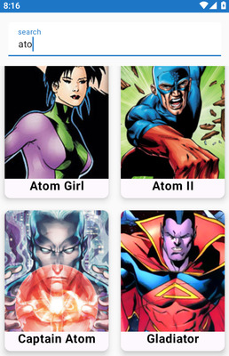
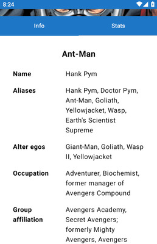
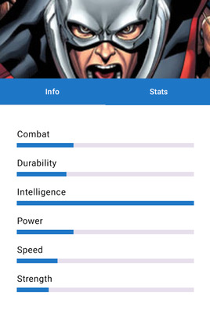

# HeroDaggerHilt

HeroDaggerHilt es una aplicación móvil desarrollada en Kotlin, que utiliza las siguientes tecnologías principales:

## Funcionalidades
- Lista de superhéroes obtenida de una API externa.
- Pantalla de detalles para cada superhéroe.
- Arquitectura basada en **MVVM** y uso de **Flow** para la gestión de estados.
- Navegación basada en **Jetpack Compose Navigation**.
- Inyección de dependencias mediante **Dagger Hilt**.

## Arquitectura

El proyecto sigue el patrón de arquitectura MVVM:
- **Model**: Gestión de los datos y la lógica de negocio.
- **ViewModel**: Manejo de los estados de UI.
- **View**: Interfaz de usuario creada con Jetpack Compose.

## Capturas de Pantalla

    
    
    

